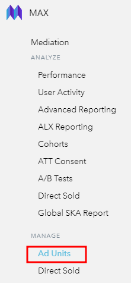
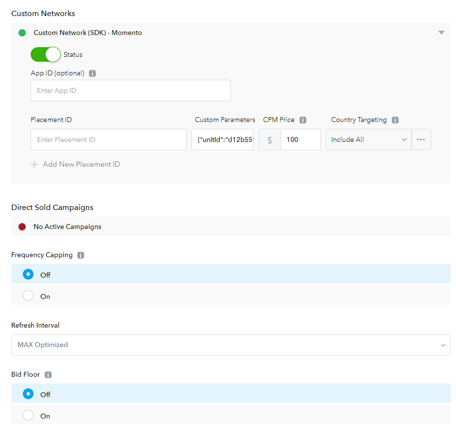

# Momento Applovin Android 어댑터 가이드 (Ver 1.0)

이 가이드는 Applovin Max 미디에이션 SDK를 활용하여 Momento SDK를 미디에이션 네트워크로 활용하려는 매체사 안내 목적으로 작성되었습니다.

본 어댑터는 Native Android 전용으로 개발되었습니다.

Flutter, Cordova, React native 등 크로스 플랫폼 프레임워크 및 Unity, Unreal 등 게임엔진으로 개발된 앱, 게임 등에 어댑터를 탑재하려고 하실 경우 꼭 contact@momento.team 으로 연락 부탁 드립니다.

## 활용 전제조건

1. Applovin을 미디에이션 SDK로 활용할 것
    - 이 가이드는 매체사의 앱에 Applovin SDK를 탑재한 상태로 최소 하나의 광고 단위를 설정한 것을 전제로 합니다.
    - 만약 위와 같은 상황이 아니시라면 Applovin SDK 탑재를 위해 [링크된 가이드](https://dash.applovin.com/documentation/mediation/android/getting-started/integration)를 먼저 확인해주시기 바랍니다.
        
       
2. 모멘토 SDK를 탑재한 상태일 것
    - 1.0.2 버전 이상의 모멘토 SDK를 매체사의 앱에 탑재한 상태여야 합니다.
    - 모멘토 SDK를 탑재하는 방법은 [링크](README.md)를 확인해 주세요.

### Momento Applovin Android 어댑터 탑재 및 세팅 방법

1. Momento에 연락 주시면, 지면 별 unitid를 전달 드립니다.
2. Applovin 계정에 로그인 합니다.
3. 좌측 사이드 바에서 **MAX**, **Mediation**을 클릭하고, MANAGE 영역에 있는 **Networks** 메뉴를 클릭합니다. 


1. 하단으로 스크롤을 내려 “**Click Here to add a Custom Network**” 을 클릭합니다.


1. Manage Network 메뉴에서 다음과 같이 설정 후 **Save** 버튼을 클릭합니다.
    - Network Type ⇒ **SDK**
    - Custom Network Name ⇒ **Momento**
    - iOS Adapter Class Name ⇒ 추후 지원 예정
    - Android / Fire OS Adapter Class Name ⇒ **com.applovin.mediation.adapters.custom.MomentoIncCustomAdapter**
    
    
    
2. 좌측 사이드 바에서 **MAX**, **Mediation**을 클릭하고, MANAGE 영역에 있는 **Ad Units** 메뉴를 클릭합니다. 



1. Momento 를 활용하고자 하는 Ad unit을 클릭합니다.
2. 스크롤을 쭉 내려 Custom Networks (SDK) - Momento 를 확인하고, Status 스위치를 클릭하여 초록불로 만듭니다.
    1. Custom Parameters에 JSON 포맷으로 다음과 같이 입력합니다. ⇒ {"unitId":"**모멘토에서 발급 받은 unitid**"}



2. dependency 추가
    ```kotlin
        allprojects {
            repositories {
                ...
                maven { url 'https://jitpack.io' }
            }
        }

    dependencies {
            implementation 'com.github.momento-ads:applovin-android-adapter:Tag'
    }
    ```
이로써 Momento Applovin 어댑터 설정이 완료되었습니다.


질문이 있으실 경우 contact@momento.team 으로 연락 주시면 감사하겠습니다.
