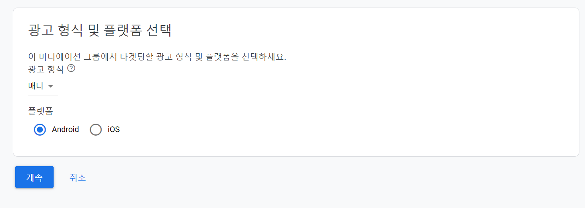
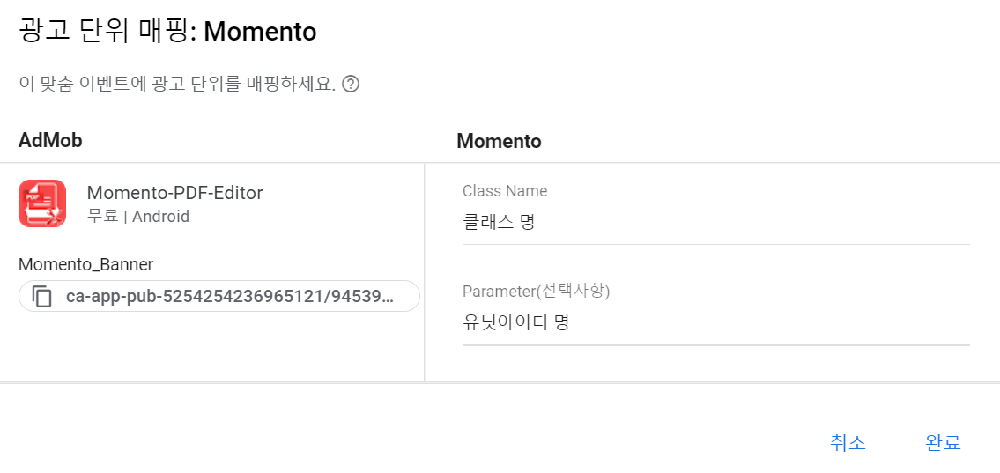

# Momento Admob Android 어댑터 가이드 (ver 1.0)

이 가이드는 Admob 미디에이션 SDK를 활용하여 Momento SDK를 미디에이션 네트워크로 활용하려는 매체사 안내 목적으로 작성되었습니다.

본 어댑터는 Native Android 전용으로 개발되었습니다.

Flutter, Cordova, React native 등 크로스 플랫폼 프레임워크 및 Unity, Unreal 등으로 개발된 앱, 게임 등에 어댑터를 탑재하려고 하실 경우 꼭 contact@momento.team 으로 연락 부탁 드립니다.

- 참고
    - Momento는 커스텀 이벤트 파트너로 설정됩니다. 따라서 Admob 대시보드에 Momento 데이터를 Import 할 수는 없습니다.
    - Momento 데이터는 Momento에서 자체적으로 제공하는 API를 통해 Export 할 수도 있으며, 라이브 전, 후로 데이터 확인 용 API(리포트API) 를 전달 드립니다.

## 활용 전제조건


1. Admob을 미디에이션 SDK로 활용할 것
    1. 이 가이드는 매체사의 앱에 Admob SDK를 탑재한 상태로 최소 하나의 광고 단위를 설정한 것을 전제로 합니다.
    2. 만약 위와 같은 상황이 아니시라면 아래의 Admob 가이드를 먼저 확인해주시기 바랍니다.
        1. 미디에이션 전반적인 설명 : [support.google.com/admob/answer/2413211](https://support.google.com/admob/answer/2413211)
        2. 미디에이션 가이드 : [https://developers.google.com/admob/android/mediation](https://developers.google.com/admob/android/mediation)
        
       
2. 모멘토 SDK를 탑재한 상태일 것
    1. 1.0.2 버전 이상의 모멘토 SDK를 매체사의 앱에 탑재한 상태여야 합니다.
    2. 모멘토 SDK를 탑재하는 방법은 [링크](README.md) 를 확인해 주세요.
    
    ```groovy
    allprojects {
            repositories {
                ...
                maven { url 'https://jitpack.io' }
            }
        }

    //dependency
    implementation 'com.github.momento-ads:admob-android-adapter:0.0.2'
    ```
    

## Momento Admob Android 어댑터 탑재 및 Admob 세팅 방법


1. Gradle를 활용, Momento Admob 어댑터를 탑재할 수 있습니다.
2. Momento에 연락 주시면, 지면 별 unitid를 전달 드립니다.
3. Admob 계정에 로그인 합니다.
4. 좌측 사이드 바에서 **미디에이션**을 클릭하고, **미디에이션 그룹 만들기** 버튼을 클릭합니다. 만약 기존에 만들어 놓은 미디에이션 그룹에 모멘토를 추가하시려면, 해당 미디에이션 그룹을 클릭합니다.

    

5. 생성을 원하시는 광고 형식 및 플랫폼 Android 를 선택하고 **계속 버튼**을 클릭합니다.

    

6. 위치,광고 단위를 설정합니다. 

7. 하단으로 스크롤을 내려 광고 소스 중 폭포식 섹션에서 **맞춤 이벤트 추가 버튼**을 클릭합니다.

    

8. 맞춤이벤트 추가에서 분류에 “Momento” 를 입력하고, 수동 eCPM에는 Momento의 미디에이션 순위 지정을 위해 단가를 설정해줍니다.

    

9. 광고단위 추가 버튼을 누릅니다. Momento와 연결할 광고단위를 확인합니다. 이후 광고단위 Class Name에 어댑터 클래스명을 입력하고 Parameter(선택사항) 에 Momento에서 제공받은 unitid와 배너 지면의 경우 배너 사이즈를 입력해줍니다.

    ```
    //예시
    unit_id=90e71c2ef-1de8-4a84-84ca-4a58jnj1c0,banner_size=BANNER_320_50
    ```

    

10. 이로써 Momento Admob 어댑터 설정이 완료되었습니다.

질문이 있으실 경우 contact@momento.team 으로 연락 주시면 감사하겠습니다.
