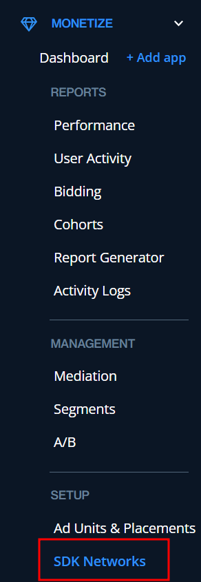
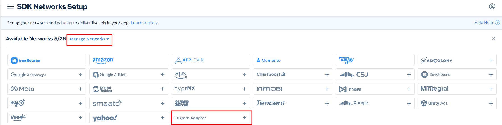

# Momento ironSource Android 어댑터 가이드 (Ver 1.0)

이 가이드는 ironSource 미디에이션 SDK를 활용하여 Momento SDK를 미디에이션 네트워크로 활용하려는 매체사 안내 목적으로 작성되었습니다.

본 어댑터는 Native Android 전용으로 개발되었습니다.

Flutter, Cordova, React native 등 크로스 플랫폼 프레임워크 및 Unity, Unreal 등 게임엔진으로 개발된 앱, 게임 등에 어댑터를 탑재하려고 하실 경우 꼭 contact@momento.team 으로 연락 부탁 드립니다.

- ironSource 미디에이션 SDK를 활용할 경우, Momento에서는 배너 광고는 제공할 수 없습니다. 이는 ironSource 사가 이를 지원하지 않기 때문입니다.

### 활용 전제조건

1. ironSource를 미디에이션 SDK로 활용할 것
    1. 이 가이드는 매체사의 앱에 ironSource SDK를 탑재한 상태로 최소 하나의 광고 단위를 설정한 것을 전제로 합니다.
    2. 만약 위와 같은 상황이 아니시라면 ironSource SDK 탑재를 위해 [해당 가이드](https://developers.is.com/ironsource-mobile/android/android-sdk/#step-1)를 먼저 확인해주시기 바랍니다.
2. 모멘토 Adapter를 탑재한 상태일 것
    1. 1.0.6 버전 이상의 모멘토 SDK를 매체사의 앱에 탑재한 상태여야 합니다.
    2. 모멘토 SDK를 탑재하는 방법은 [가이드](README.md)를 확인해 주세요.

### Momento ironSource Android 어댑터 탑재 및 ironSource 세팅 방법

1. Momento에 연락 주시면, 지면 별 unitid를 전달 드립니다.
2. ironSource 계정에 로그인 합니다.
3. 좌측 사이드 바에서 **MONETIZE**을 클릭하고, SETUP 영역에 있는 **SDK Networks** 메뉴를 클릭합니다. 
    
    
    

1. 상단의 “Manage Networks” 을 클릭합니다. 이후 Custom Adapter 를 클릭합니다.
    
    
    
2. Network Key에 **15bb89335** 를 입력합니다. 이후 “**Enter Key”** 를 클릭합니다. 이후 나타나는 창에서 “**Rate based revenue”**를 클릭하고 Save 버튼을 누릅니다.
    
    
    
    .png)
    
3. 포맷을 선택한 뒤 모멘토에서 지급받은 Unitid를 Unitid에 입력합니다. 이후 “**Save**” 버튼을 누릅니다.
    
    
    
4. 필요한 경우 “**Add Network Instance**” 를 누르고 추가로 발급받은 Unitid를 입력합니다.
5. dependency 추가
    ```kotlin
        allprojects {
            repositories {
                ...
                maven { url 'https://jitpack.io' }
            }
        }

    dependencies {
            implementation 'com.github.momento-ads:ironsource-android-adapter:Tag'
    }
    ```
6. 이로써 Momento ironSource 어댑터 설정이 완료되었습니다.

질문이 있으실 경우 contact@momento.team 으로 연락 주시면 감사하겠습니다.
